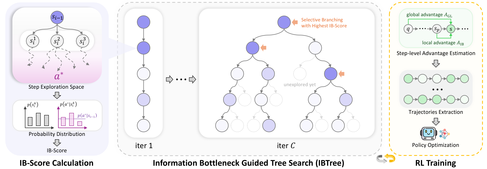

# Information Bottleneck Driven Tree-based Policy Optimization

<!-- This is the official repository for the paper *"Long Live the Balance: Information Bottleneck Driven Tree-based Policy Optimization"*, accepted at **ICML 2026**. -->

  <b>Long Live The Balance: Information Bottleneck Driven Tree-based Policy Optimization</b>
   
  <em>ICML 2026</em>

  <a href="https://arxiv.org/abs/2605.28109">arXiv</a> &bull;
  <a href="https://arxiv.org/pdf/2605.28109">Paper</a> &bull;
  <a href="#citation">Citation</a>

---

  

Code coming soon.
